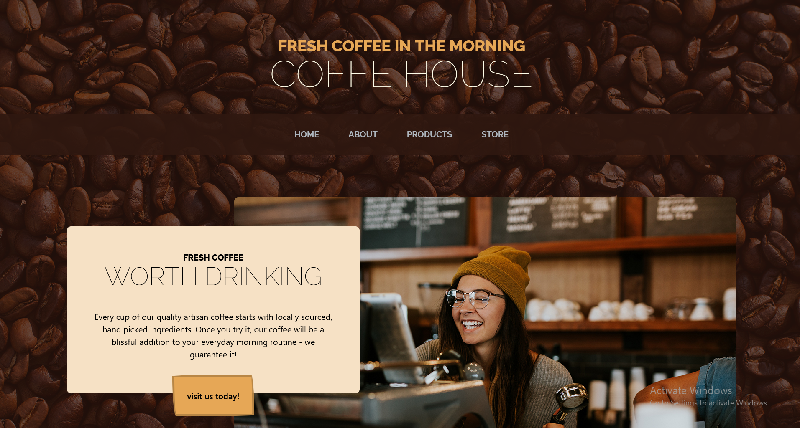
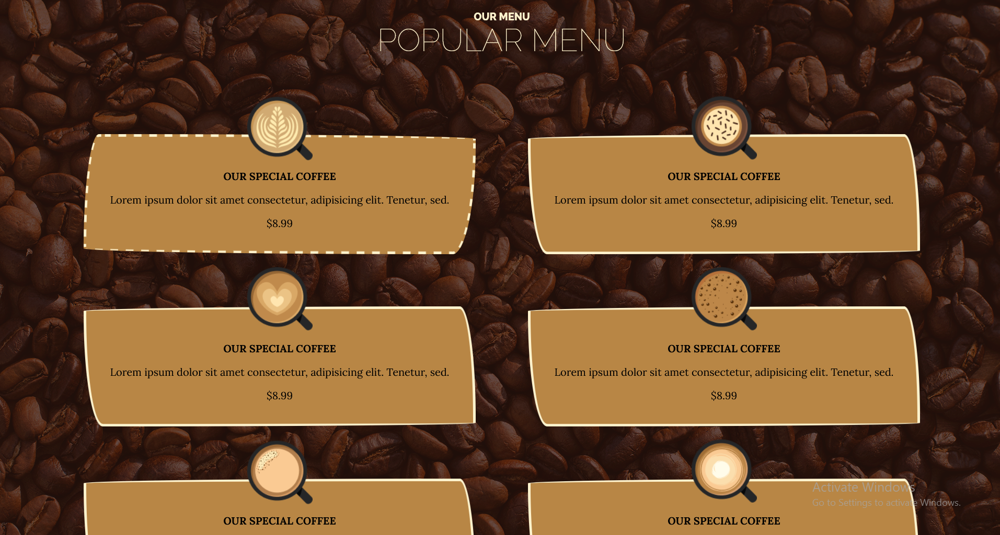
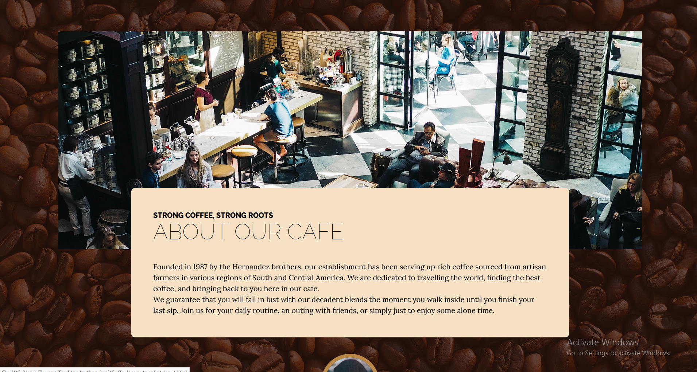
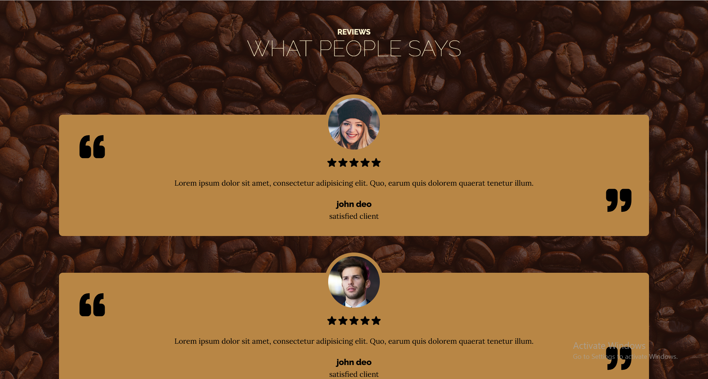
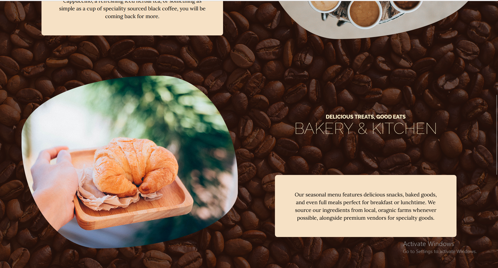
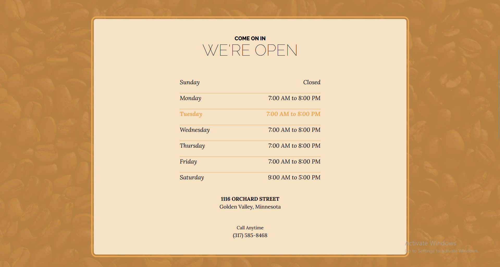
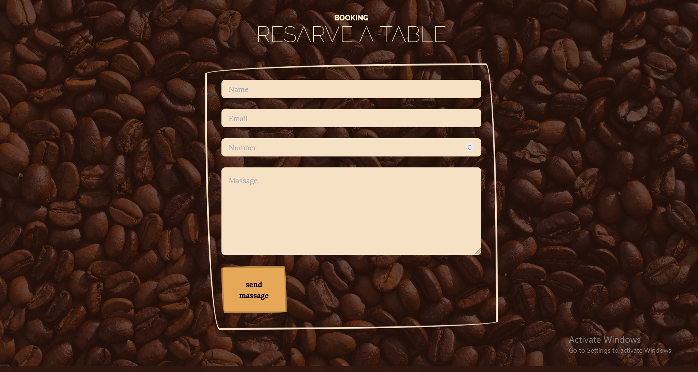

# Coffe House ☕

⚡Project for 5th July - Subject -> **Coffe-website**

I made this coffee website with tailwind css and I really enjoy this framework.
And just so you know I made this in just 2 days. My hands are getting fast 🙃

## 🔗 See Live Demo [here](https://strassntial.github.io/coffe-house/) .

###  Technologies used :
>
> - Html
> - Css
>- Tailwind css 

### 👀 How does the website look?
#### Home 

### Menu

### About

### Reviews

### Products

### Store

### Form

### ✔️ To-Do's
🌝I find that dark mode is very easy in Tailwind. So I will add this feature to my website  
🌝Add JavaScript to pages and make it dynamic
### 🌌 License  
Free to use ;)